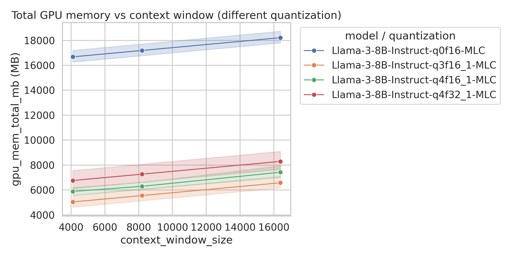
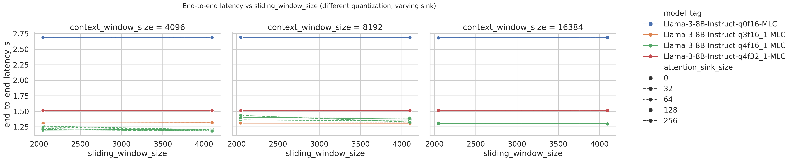
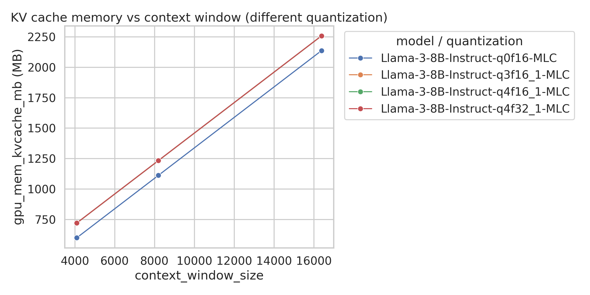

[](https://classroom.github.com/a/v3c0XywZ)
# Towards Fast and Efficient Deep Neural Network Deployment: Supporting Diverse Quantization in the TVM Compiler
ECE 4332 / ECE 6332 — AI Hardware Design and Implementation  
Fall 2025

## 🧭 Overview
This repository contains the code, scripts, and documentation for our AI Hardware course project.  
We build on **MLC-LLM** and **TVM** to study **efficient deployment of quantized large language models (LLMs)** on GPUs, with a focus on:
- Supporting diverse quantization formats in the compilation pipeline
- Exploring KV cache design spaces (context window, batch size, sliding window, etc.)
- Understanding trade-offs between memory footprint, throughput, latency, and model quality (PPL)

## 🗂 Folder Structure
- `docs/` – project proposal and documentation for this specific project  
- `presentations/` – midterm and final presentation slides for our team  
- `report/` – final written report and related materials  
- `src/` – source code for software, hardware, and experiments  
  - most of our work lives in `src/mlc_llm/` (see **Code Layout in This Repo** below)  
- `data/` – datasets or pointers to data used in our experiments

## 🧑‍🤝‍🧑 Team
- **Team name**: Eat, Sleep, Do AI  
- **Members**:
  - Liangtao Dai  
  - Elton Jhang  
  - Haonan Ke  
  - Xinwei Li  

More details about roles and responsibilities are documented in `docs/Project_Proposal.md`.

## 📋 Project Artifacts
By the end of the semester, this repo will contain:
1. **Reproducible MLC-LLM + TVM scripts** for quantized LLM deployment and KV cache DSE (under `src/mlc_llm/dailt_workplace/`)  
2. **CSV logs and plots** analyzing memory, throughput, latency, and PPL (under `src/mlc_llm/dailt_workplace/dse/`)  
3. **Presentation slides** summarizing methodology and results (under `presentations/`)  
4. **Final report** with technical details and analysis (under `report/`)  

## 🚀 How to Use This Repository
If you want to **run our code or reproduce results**, start from:

1. The **Quick Start for Our Code** section below (environment setup + basic commands)  
2. The detailed usage guide in  
   `src/mlc_llm/dailt_workplace/HowTo.md`  

## 🧪 This Team's Project

Our team project focuses on **efficient deployment of quantized large language models using the MLC-LLM framework and TVM**.  
We study how different **quantization schemes** and **KV cache configurations** affect:
- GPU memory footprint
- Throughput (tokens/s or chars/s)
- End-to-end and first-token latency
- Model quality (PPL on language modeling benchmarks)

High-level goals:
- Support **diverse quantization formats** in the compilation flow.
- Explore **design spaces** (context window, batch size, sliding window, etc.) for KV cache.
- Provide **reproducible scripts** and **plots** to visualize the trade-offs between memory, speed, and accuracy.

## 🔧 Code Layout in This Repo

- `docs/` – proposal and project documentation (including technical plan and responsibilities)  
- `presentations/` – project slides (midterm + final)  
- `report/` – final report sources  
- `src/` – main source code:
  - `src/hardware/` – hardware-related experiments or configurations (if any)
  - `src/model/` – model-related scripts (if any)
  - `src/mlc_llm/` – **MLC-LLM framework (upstream source + our extensions)**
    - `dailt_workplace/` – **our working directory inside MLC-LLM**
      - `dse/` – KV cache design space exploration, PPL evaluation and plotting scripts
      - `test/` – small helper scripts for quick tests

For details on how to use the MLC-LLM framework **within this project**, see:  
`src/mlc_llm/dailt_workplace/HowTo.md`

## 🚀 Quick Start for Our Code

From the repo root:

```bash
cd src/mlc_llm
```

1. **Environment (cluster or local)**  
   - Create/activate Conda env (example):
     ```bash
     conda create -n mlc-llm-env python=3.11 -y
     conda activate mlc-llm-env
     ```
   - Install MLC-LLM from source:
     ```bash
     pip install -e .
     ```
   - Or use the helper script (if on the course cluster):
     ```bash
     bash run_mlc.sh
     ```

2. **Basic MLC-LLM Chat**  
   ```bash
   mlc_llm chat HF://mlc-ai/Llama-3-8B-Instruct-q4f16_1-MLC
   ```

3. **Run our KV cache DSE and plots**  
   - KV cache benchmark + metrics: see commands in  
     `src/mlc_llm/dailt_workplace/dse/dse_kv_cache_cmds.md`
   - PPL evaluation and visualization:  
     `eval_ppl_wikitext2.py`, `plot_wikitext2_ppl.py`  
   - Memory / throughput / latency visualization:  
     `plot_kv_cache_memory.py`, `plot_kv_cache_quantization.py`, `plot_throughput_quantization.py`

These scripts together reproduce our experiments on **quantization-aware deployment of LLMs** using **MLC-LLM + TVM**.

## 📈 Example Result 1: Total GPU Memory vs Context Window

This figure shows **total GPU memory usage vs context window size** for different quantized versions of `Llama-3-8B-Instruct` compiled with MLC-LLM:



Key observations:
- **Memory grows roughly linearly with the context window size** for all quantization schemes, as expected from KV cache scaling.
- The **FP16-like baseline (`q0f16`) consumes about 2–3× more total GPU memory** than the 3–4 bit quantized variants across all context lengths.
- Among quantized models, **`q3f16_1` uses the least memory**, while `q4f16_1` and `q4f32_1` trade slightly higher memory for better numerical precision.
- These results highlight that **aggressive KV/cache quantization can significantly reduce memory usage** and enable much longer context windows under the same GPU memory budget.

## ⏱️ Example Result 2: End-to-End Latency vs Sliding Window Size

We also evaluate **end-to-end latency** as we vary the **sliding window size** and **attention sink size** under different context windows and quantization schemes:



Key observations:
- Across all three context windows (4096 / 8192 / 16384), **end-to-end latency is relatively flat** as we increase the sliding window size, indicating that the engine amortizes the KV cache reuse efficiently.
- For a fixed context and sliding window, **more aggressive quantization (e.g., `q3f16_1`, `q4f16_1`) slightly reduces latency** compared to the FP16-like baseline, consistent with lower memory traffic.
- Changing the **attention sink size** (0 → 256) has only a modest impact on end-to-end latency in this setting, but it does change the effective memory footprint and can matter at larger batch sizes.
- Overall, the results suggest that **we can tune sliding window and sink size to save memory without significantly hurting end-to-end latency**, especially when combined with low-bit quantization.

## 🧠 Example Result 3: KV Cache Memory vs Context Window

In addition to total memory, we also isolate **KV cache memory vs context window size** for different quantization schemes:



Key observations:
- KV cache memory scales **almost perfectly linearly** with the context window, confirming the expected \\(O(T)\\) dependence on sequence length.
- Compared to the FP16-like baseline (`q0f16`), **4-bit KV quantization (`q4f16_1`, `q4f32_1`) roughly halves the KV cache memory** at the same context length.
- The gap between different 4-bit formats (e.g., `q4f16_1` vs `q4f32_1`) is relatively small, suggesting we can often choose the numerically more stable format without a huge KV memory penalty.
- Combining these KV-specific savings with overall model weight quantization is critical to **fit long-context LLMs on a single GPU** while keeping latency acceptable.

## 📜 License
This project is released under the MIT License.
